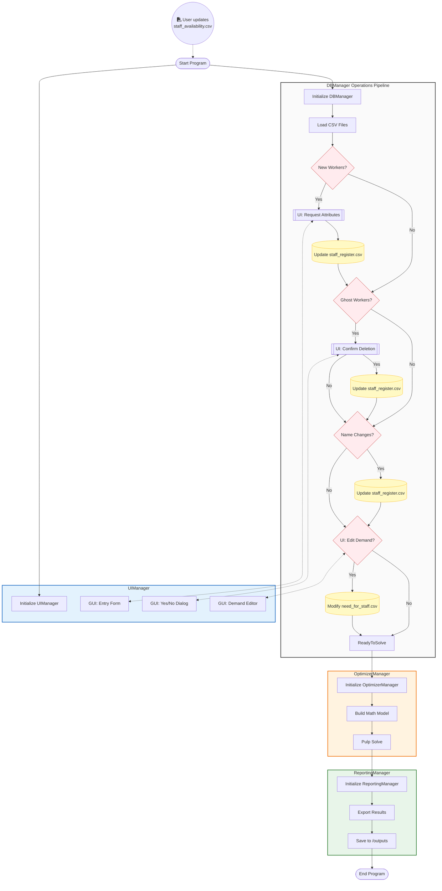

# Optimization-Based Workforce Scheduling System  
## Summary  : 

This project implements a workforce scheduling system formulated as a Binary Integer Programming (BIP) problem. 

The system models staff availability, role requirements, operational constraints and soft penalties to generate an optimal weekly schedule under business (various) constraints needs.

## Mathematical Formulation

---
**General Idea** : In order to avoid infeasibility issue we penalize the objective using slack variables. The slack variables are then reported in the Shortage_Report.txt
- **Other constraints** :The problem is fairly simple but the business case didn't need any other type of constraint such as Incompatibility between two workers, minimum time between two shifts etc ... 
- **Other objectives** : A weighting schema will accentuate the priority over different type of shortage. Also, we can include a fairness constraint between the different workers based on various criteria (the worker the more available have priority, the assignement need to minimize the STD between workers etc... )
 


## Project Structure 
```
├── config.yaml                # Central configuration file
├── requirements.txt           # Python dependencies
│
├── data/                      # Input CSV files
│   ├── staff_availability.csv # Employee availability data
│   ├── need_for_staff.csv     # Staffing requirements per shift
│   └── staff_register.csv     # Employee master data
│
├── outputs/                   # Generated outputs
│   ├── Weekly_Staff_Schedule.xlsx
│   ├── Weekly_Staff_Schedule.pdf
│   └── Shortage_Report.txt
│
├── logs/
│   └── staff_scheduler.log    # Application logs
│
└── src/
    ├── main.py                # Application entry point
    ├── optimizer_manager.py   # Scheduling optimization logic (BIP/MIP)
    ├── db_manager.py          # Data loading and management
    ├── reporting_manager.py   # Excel/PDF report generation
    ├── ui_manager.py          # User interface logic
    └── utility.py             # Helper functions
```

### data : 

The code uses three main CSV files:


#### 1. `need_for_staff.csv`

| Role      | Mon 14h | Mon 18h | Mon 19h | Tue 14h | Tue 18h | Tue 19h | Wed 14h | Wed 18h | Wed 19h | Thu 14h | Thu 18h | Thu 19h | Fri 14h | Fri 18h | Fri 19h | Sat 14h | Sat 18h | Sat 19h | Sun 14h | Sun 18h | Sun 19h |
|-----------|---------|---------|---------|---------|---------|---------|---------|---------|---------|---------|---------|---------|---------|---------|---------|---------|---------|---------|---------|---------|---------|
| Waiter    | 1       | 2       | 1       | 1       | 1       | 1       | 1       | 2       | 2       | 1       | 2       | 2       | 2       | 3       | 4       | 2       | 4       | 4       | 1       | 2       | 2       |
| Bartender | 1       | 1       | 2       | 1       | 1       | 1       | 1       | 1       | 2       | 1       | 2       | 2       | 2       | 2       | 3       | 2       | 3       | 3       | 1       | 1       | 2       |

*Template for staff demand per shift; can be adapted weekly inside the UI.*


#### 2. `staff_availability.csv`

| Horodateur          | Name            | Email                     | Monday        | Tuesday   | Wednesday        | Thursday     | Friday       | Saturday       | Sunday   |
|--------------------|-----------------|---------------------------|---------------|-----------|-----------------|-------------|-------------|---------------|---------|
| 11/02/2026 14:15:00 | Gordon Ramsay    | gordon.ramsay@example.com | 14h, 18h, 19h | 18h, 19h | 14h, 19h        | 14h, 18h    | 18h, 19h    | 14h, 18h, 19h | 19h     |
| 11/02/2026 14:15:00 | Anthony Bourdain | anthony.bourdain@example.com | 14h, 18h      |           | 14h, 18h, 19h   | 18h, 19h    | 14h         | 14h, 18h      | 14h     |
| 11/02/2026 14:15:00 | Jeremy Clarkson  | jeremy.clarkson@example.com | 18h, 19h      | 19h       | 18h             | 18h, 19h    | 14h         | 18h, 19h      | 14h, 18h |
| 11/02/2026 14:15:00 | Margot Robbie    | margot.robbie@example.com | 14h, 18h, 19h | 14h       | 14h, 18h, 19h   | 14h         | 14h, 18h    | 18h, 19h      | 14h     |
| 11/02/2026 14:15:00 | Richard Hammond  | richard.hammond@example.com | 19h           | 18h, 19h | 19h             | 18h, 19h    | 19h         | 14h           | 14h, 18h, 19h |

*Weekly staff availability from Google Form CSV.*


#### 3. `staff_register.csv`

| Name                  | Role      | Till Authorized | Is Manager | Email                       |
|----------------------|-----------|----------------|------------|-----------------------------|
| Gordon Ramsay         | Both      | Yes            | Yes        | gordon.ramsay@example.com   |
| Anthony Bourdain      | Bartender | Yes            | No         | anthony.bourdain@example.com|
| Jeremy Clarkson       | Waiter    | No             | No         | jeremy.clarkson@example.com |
| Richard Hammond       | Waiter    | Yes            | No         | richard.hammond@example.com |
| Marco Pierre White    | Both      | Yes            | Yes        | marco.pierre.white@example.com |

*Master register of all staff; editable weekly inside the UI.*


### logs : 

A report of eventual errors, modification of db and various information about the eventual bugs. 

### outputs : 

- Shortage_Report.txt : a simple report with the missing role for each shift.  
- Weekly_Staff_Schedule.xlsx : final excel schedule.
- Weekly_Staff_Schedule.pdf : the schedule format to pdf.

### src : 

General Idea : the choice of the stack can be changed as long as each class implement the same API (function and report type)

---

**DBManager**
- Tech : Pandas
- Responsibility : Handle **Reconciliation Process** i.e detect ghost workers / detect new workers / apply permanent change to staff_register.csv or temporary change to need_for_staff.csv
    
---
**UiManager** 
- Tech : FreeSimpleUI
- Responsibility : Handle **User Interaction** i.e collect data from user (modification , supression and infos)

---
**OptimizerManager** 
- Tech : Pulp
- Responsibility: **Solve** the problem

---
**ReportingManager**
- Tech : pandas, matplotlib
- Responsibility: **Report** the result of the app

## Pipeline 



---

Few Comments about the current pipeline : 

- **Automation** : As "staff_availibility.csv" is based on template from google forms export csv the whole pipeline can be automated using google api for upload result from the form and launch a new form.
- **GUI** : While operationnal using FreeSimpleGui is not the more convenient for user interface and visualization of dataframes like staff_register or need_for_staff. Typically, an interface based on Html and CSS will be more handy.
- **Feedback loop from user** : What is currently missing is a feedback loop with the user about the proposed solutions handle by the **ReportingManager** class. 

## Running the Project 
```
 1- Create venv : python -m venv .venv 
 2- Activate : .venv\Scripts\activate 
 3- Populate venv : pip install -r requirements.txt
 4- Running the code : python src/main.py
```

## Making a standalone application 
In order to be used by all type of people, the repo can be made into a standalone application using the following command with pyInstaller : 
```
python -m PyInstaller --noconfirm --onedir --windowed --name "Staff_Scheduler" --collect-all pulp --add-data "config.yaml;." --add-data "data;data" --add-data "outputs;outputs" --add-data "logs;logs" main.py

```

## Future Improvements 
- **UI and FeedbackLoop** : Switch this simple pratical UI to something nicer and more user friendly that will implement a **feedback loop**.
- **Add Unit Test** 
- **Benchmark performance** : Observe the growth of the solving time in function of the size of the input (Number of workers, Number of shifts) 
- **New type of Optimizer** : BIP is not the only possible way to solve the problem in an exact manner (ex: CP). Also, **for larger problem** with more constraints and/or more workers exact approach will become untractable thus the implementation of **approximate algorithm** such as Grasp algorithm will ensure robustness of the pipeline. 
 
# Schedule-

